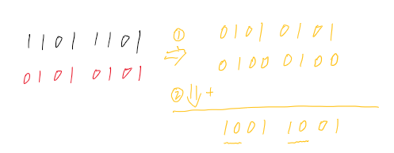

# 汉明重量
编写一个函数，输入是一个无符号整数，返回其二进制表达式中数字位数为 ‘1’ 的个数（也被称为汉明重量）。


## n&1
```python
def hamming_weight(n: int) -> int:
    re = 0
    while n > 0:
        re += n & 1
        n >>= 1
    return re
```

## n&(n-1)
```python
def hamming_weight(n: int) -> int:
    re = 0
    while n > 0:
        n &= (n - 1)
        re += 1
    return re
```

## 错位取位
```python
def hamming_weight(n: int) -> int:
    n = (n & 0x55555555) + ((n >> 1) & 0x55555555)
    n = (n & 0x33333333) + ((n >> 2) & 0x33333333)
    n = (n & 0x0f0f0f0f) + ((n >> 4) & 0x0f0f0f0f)
    n = (n & 0x00ff00ff) + ((n >> 8) & 0x00ff00ff)
    n = (n & 0x0000ffff) + ((n >> 16) & 0x0000ffff)
    return n
```
不断错位再相加，保证1的位数没有丢失。

为简化理解，计算8位的数字中为1的位数量和。例如： 1101_1101



第一步，将原数字1101_1101同0101_0101（掩码）按位与&错一位按位与，得到两个数：0101_0101, 0100_0100，这两个数其实包含了原数字1101_1101中的所有0（因为错位，0没有丢失）

第二步，再将刚得到的两个数相加，得到1001_1001，如果这时候我们依次看两位，首两位10的对应数字为2，可理解为2个0，也没有产生0的丢失

不断进行下去，直到用一个数字能表示出0的个数

## JDK算法
```python
def hamming_weight(n: int) -> int:
    n = n - ((n >> 1) & 0x55555555)
    n = (n & 0x33333333) + ((n >> 2) & 0x33333333)
    n = (n + (n >> 4)) & 0x0f0f0f0f
    n = n + (n >> 8)
    n = n + (n >> 16)
    return n & 0x3f
```