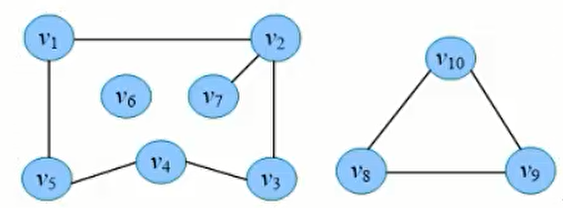

# 图
## 概念
### 连通图
无向图中，如果顶点vi到vj有路径，则称vi和vj是联通的。如果图G中任意两个顶点都是连通的，则称G为连通图。
### 连通分量
无向图G的极大连通子图称为G的连通分量。极大连通子图的意思是：该子图是G的连通子图，如果再加入一个顶点，该子图不连通。  
对于连通图，则其连通分量就是他自己，对于非连通图，至少有2个连通分量。

例如：  

上图有三个连通分量  

### 强连通图
有向图G中，如果图中任务两个节点a, b都满足a到b有路径，且b到a有路径，则G为强连通图。

### 强连通分量
即：极大强连通子图。需满足三个条件：
1. 子图。
2. 强连通图。
3. 极大。此子图如果再多一个节点，则变为不连通的。

例如：  

1. a是强连通图
2. b不是强连通图
3. c是b的强连通分量

## 参考
https://jasonxqh.github.io/2020/05/15/连通分量/