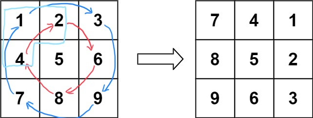
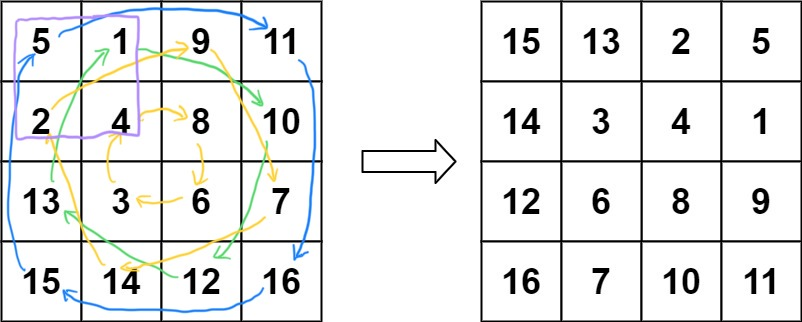

# 矩阵旋转
给定一个 n × n 的二维矩阵 matrix 表示一个图像。请你将图像顺时针旋转 90 度。
- 你必须在 原地 旋转图像，直接修改输入的二维矩阵。

示例1：  

```
输入：matrix = [[1,2,3],[4,5,6],[7,8,9]]
输出：[[7,4,1],[8,5,2],[9,6,3]]
```
示例2：  

```
输入：matrix = [[5,1,9,11],[2,4,8,10],[13,3,6,7],[15,14,12,16]]
输出：[[15,13,2,5],[14,3,4,1],[12,6,8,9],[16,7,10,11]]
```

来源： https://leetcode.cn/problems/rotate-image/

## 解法一
两次翻转。`\ + |` 或者 `—— + \ `。

以 `\ + |` 为例：
```python
def rotate(matrix):
    le = len(matrix)
    for i in range(le):
        for j in range(i):
            matrix[i][j], matrix[j][i] = matrix[j][i], matrix[i][j]
    for i in range(le):
        for j in range(le // 2):
            matrix[i][j], matrix[i][le - j - 1] = matrix[i][le - j - 1], matrix[i][j]
    return matrix


assert rotate([[1, 2, 3], [4, 5, 6], [7, 8, 9]]) == [[7, 4, 1], [8, 5, 2], [9, 6, 3]]
assert rotate([[5, 1, 9, 11], [2, 4, 8, 10], [13, 3, 6, 7], [15, 14, 12, 16]]) == [[15, 13, 2, 5], [14, 3, 4, 1],
                                                                                   [12, 6, 8, 9], [16, 7, 10, 11]
```

## 解法二
一次旋转  


```python
def rotate(matrix):
    n = len(matrix)
    for i in range((n + 1) // 2):
        for j in range(n // 2):
            matrix[i][j], matrix[n - 1 - j][i], matrix[n - 1 - i][n - 1 - j], matrix[j][n - i - 1] = \
                matrix[n - 1 - j][i], matrix[n - 1 - i][n - 1 - j], matrix[j][n - i - 1], matrix[i][j]
    return matrix


assert rotate([[1, 2, 3], [4, 5, 6], [7, 8, 9]]) == [[7, 4, 1], [8, 5, 2], [9, 6, 3]]
assert rotate([[5, 1, 9, 11], [2, 4, 8, 10], [13, 3, 6, 7], [15, 14, 12, 16]]) == [[15, 13, 2, 5], [14, 3, 4, 1],
                                                                                   [12, 6, 8, 9], [16, 7, 10, 11]
```