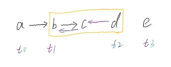

# 反转链表III
给你单链表的头指针 head 和两个整数 left 和 right ，其中 left <= right 。请你反转从位置 left 到位置 right 的链表节点，返回 反转后的链表 。

来源：[LeetCode](https://leetcode-cn.com/problems/reverse-linked-list-ii)

```
示例:
    输入: head = [1,2,3,4,5], left = 2, right = 4
    输出: [1,4,3,2,5]
```

## 反转指定区间&拼接


对区间进行反转，同时记录指定区间首尾及区间首尾前后元素：t1, t2, t0, t3



再将指定区间及指定区间前后进行拼接即可
```
t0.next = t2
t1.next = t3
```

具体代码如下：
```python
class ListNode:
    def __init__(self, val):
        self.val = val
        self.next = None


def reverse_between(head, left, right):
    t0, t1, t2, t3 = None, None, None, None
    pre, curr, idx = None, head, 0
    while curr:
        idx += 1
        if idx == left:
            t0, t1 = pre, curr
        if idx == right:
            t2, t3 = curr, curr.next
        if left < idx <= right:
            curr.next, pre, curr = pre, curr, curr.next
        else:
            pre, curr = curr, curr.next
    if t0:
        t0.next = t2
    t1.next = t3
    return t2 if left == 1 else head
```
遍历了两次，复杂度O(n + k)，k为需要反转的区间长度

## 头插法
将left后到right的每个元素依次插到left前即可。
```python
class ListNode:
    def __init__(self, val):
        self.val = val
        self.next = None


def reverse_between(head, left, right):
    dummy_node = ListNode("0")
    dummy_node.next = head
    pre = dummy_node
    # 找到指定区间的前一个节点pre
    for _ in range(left - 1):
        pre = pre.next
    curr = pre.next
    # 根据区间长度遍历多次，每次遍历将节点插至pre后面
    for _ in range(right - left):
        t = curr.next
        curr.next = t.next
        t.next = pre.next
        pre.next = t
    return dummy_node.next
```
