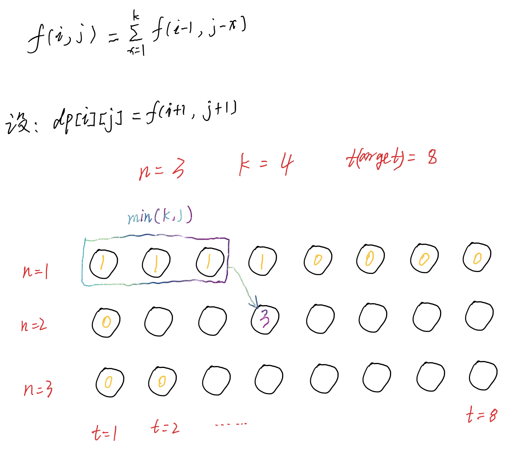

# 掷骰子等于目标和的方法数
这里有 n 个一样的骰子，每个骰子上都有 k 个面，分别标号为 1 到 k 。

给定三个整数 n ,  k 和 target ，返回可能的方式(从总共 kn 种方式中)滚动骰子的数量，使正面朝上的数字之和等于 target 。

答案可能很大，你需要对 109 + 7 取模 。


示例 1：
```
输入：n = 1, k = 6, target = 3
输出：1
解释：你扔一个有 6 个面的骰子。
得到 3 的和只有一种方法。
```

示例 2：
```
输入：n = 2, k = 6, target = 7
输出：6
解释：你扔两个骰子，每个骰子有 6 个面。
得到 7 的和有 6 种方法：1+6 2+5 3+4 4+3 5+2 6+1。
```

示例 3：
```
输入：n = 30, k = 30, target = 500
输出：222616187
解释：返回的结果必须是对 109 + 7 取模。
```


来源：https://leetcode.cn/problems/number-of-dice-rolls-with-target-sum

## 解法
记 f(i,j) 表示使用 i 个骰子且数字之和为 j 的方案数。为了计算该值，我们可以枚举最后一个骰子的数字，它的范围为 [1,k]，那么状态转移方程即为：



```python
class Solution:
    def numRollsToTarget(self, n: int, k: int, target: int) -> int:
        mod = 10**9 + 7
        dp = [1] * target if k >= target else [1] * k + [0] * (target - k)
        for i in range(1, n):
            for j in range(target - 1, -1, -1):
                if j >= i:
                    dp[j] = sum(dp[max(0, j - k):j]) % mod
                else:
                    dp[j] = 0
        return dp[-1]

```
## Tag
- 动态规划