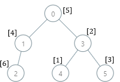

# 每棵子树内缺失的最小基因值
有一棵根节点为 0 的 家族树 ，总共包含 n 个节点，节点编号为 0 到 n - 1 。给你一个下标从 0 开始的整数数组 parents ，其中 parents[i] 是节点 i 的父节点。由于节点 0 是 根 ，所以 parents[0] == -1 。

总共有 105 个基因值，每个基因值都用 闭区间 [1, 105] 中的一个整数表示。给你一个下标从 0 开始的整数数组 nums ，其中 nums[i] 是节点 i 的基因值，且基因值 互不相同 。

请你返回一个数组 ans ，长度为 n ，其中 ans[i] 是以节点 i 为根的子树内 缺失 的 最小 基因值。

节点 x 为根的 子树 包含节点 x 和它所有的 后代 节点。


示例：


```
输入：parents = [-1,0,1,0,3,3], nums = [5,4,6,2,1,3]
输出：[7,1,1,4,2,1]
解释：每个子树答案计算结果如下：
- 0：子树内包含节点 [0,1,2,3,4,5] ，基因值分别为 [5,4,6,2,1,3] 。7 是缺失的最小基因值。
- 1：子树内包含节点 [1,2] ，基因值分别为 [4,6] 。 1 是缺失的最小基因值。
- 2：子树内只包含节点 2 ，基因值为 6 。1 是缺失的最小基因值。
- 3：子树内包含节点 [3,4,5] ，基因值分别为 [2,1,3] 。4 是缺失的最小基因值。
- 4：子树内只包含节点 4 ，基因值为 1 。2 是缺失的最小基因值。
- 5：子树内只包含节点 5 ，基因值为 3 。1 是缺失的最小基因值。
```


## 解法
- 不在基因值为1的那条向上链的所有节点，缺失的最小基因值都是1。
```python
from typing import List


class Solution:
    def smallestMissingValueSubtree(self, parents: List[int], nums: List[int]) -> List[int]:
        # 树的构建
        n = len(parents)
        children = [[] for _ in range(n)]
        for i in range(1, n):
            children[parents[i]].append(i)

        geneSet = set()  # 基因库
        visited = [False] * n  # 节点访问标记

        def dfs(_node):
            if visited[_node]:
                return
            visited[_node] = True
            geneSet.add(nums[_node])
            for child in children[_node]:
                dfs(child)

        node = nums.index(1) if 1 in nums else -1
        res, iNode = [1] * n, 1

        while node != -1:
            dfs(node)
            while iNode in geneSet:
                iNode += 1
            res[node], node = iNode, parents[node]
        return res
```