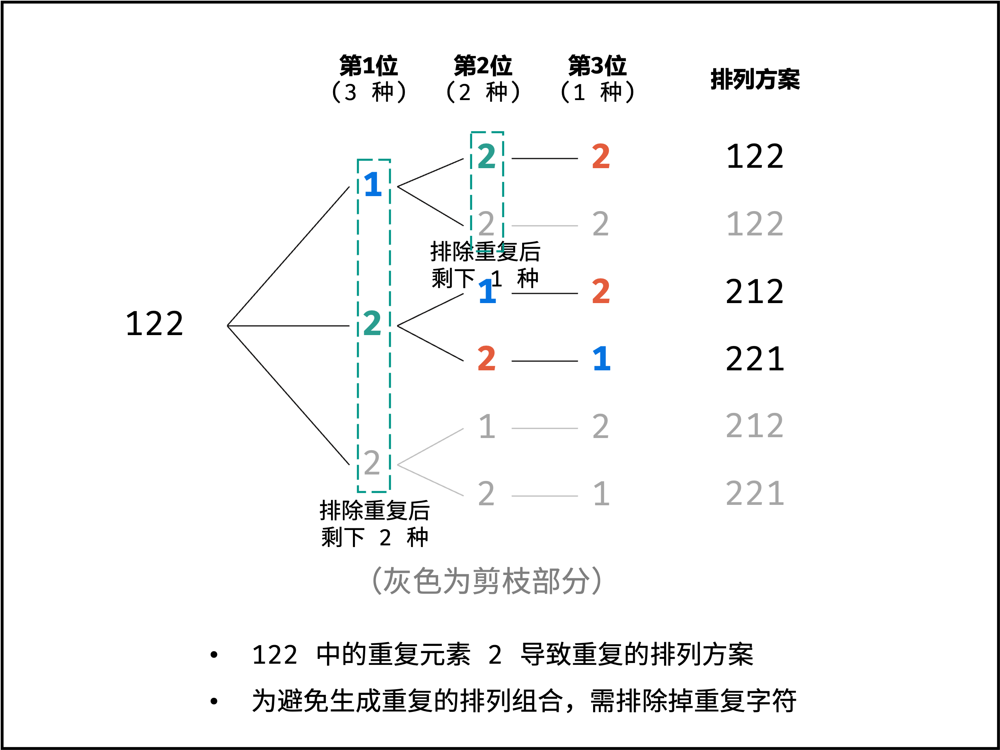

# 全排列 II
给定一个可包含重复数字的序列 nums ，按任意顺序 返回所有不重复的全排列。

示例 1：
```
输入：nums = [1,1,2]
输出：
[[1,1,2],
[1,2,1],
[2,1,1]]
```

示例 2：
```
输入：nums = [1,2,3]
输出：[[1,2,3],[1,3,2],[2,1,3],[2,3,1],[3,1,2],[3,2,1]]
```

来源：https://leetcode.cn/problems/permutations-ii/

## 解法

```python
def permute(nums):
    n = len(nums)
    res = []

    def back_tracing(curr_idx):
        if curr_idx == n - 1:
            res.append(nums[:])
            return
        chosen_num = []
        # 剪枝：同层已使用相同元素
        for i in range(curr_idx, n):
            if nums[i] in chosen_num:
                continue
            chosen_num.append(nums[i])
            nums[curr_idx], nums[i] = nums[i], nums[curr_idx]
            back_tracing(curr_idx + 1)
            nums[curr_idx], nums[i] = nums[i], nums[curr_idx]

    back_tracing(0)
    return res


print(permute([1, 1, 3]))
```

## Tag
- 回溯
- 排列